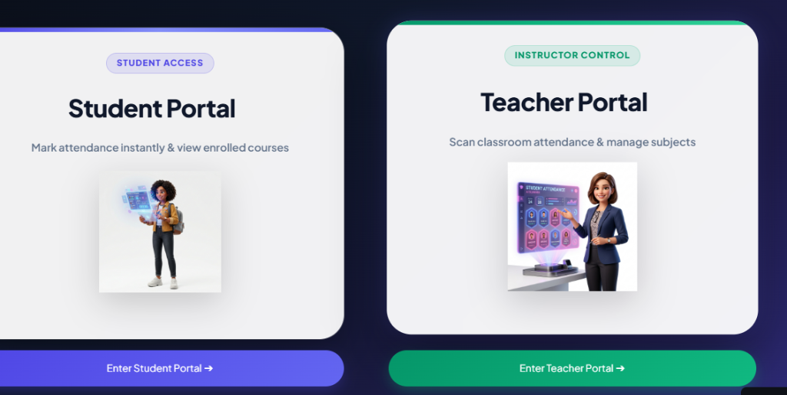

# 📸 SnapClass - AI-Powered Automated Classroom Attendance



An ultra-modern, high-performance Flask landing page and web portal for **SnapClass** — an AI-powered automated classroom attendance system featuring **Student Access** and **Instructor Control** with real-time **FaceID Recognition** and **Photo Upload Verification**.

🚀 **Live Streamlit App:** [aiattendancesystemgit-h.streamlit.app](https://aiattendancesystemgit-h.streamlit.app/)  
📦 **GitHub Repository:** [github.com/Ronakjain935/landing_page_ai_attendance_system](https://github.com/Ronakjain935/landing_page_ai_attendance_system.git)

---

## ✨ Key Features & Portals

### 🎓 Student Access Portal
- 📷 **Camera FaceID Verification:** Real-time facial positioning and instant attendance login.
- 📁 **Profile Photo Upload:** Direct image file upload (`JPG`, `PNG`) for biometric profile registration and face matching.
- 📊 **Enrolled Courses Dashboard:** View subject attendance history and compliance logs.

### 🔑 Instructor Control / Teacher Portal
- 🔐 **Password Authentication:** Encrypted teacher credentials login (`Login using password`).
- 📸 **Classroom Attendance Scanning:** Execute rapid AI facial scans and manage course rosters.
- ⚙️ **Administrative Control:** Subject creation, session logs, and report export.

---

## 📁 Project Structure

```text
snapclass_frontened/
├── app.py                 # Flask WSGI Web Application Server
├── requirements.txt       # Python Dependencies (Flask, Gunicorn)
├── vercel.json            # Vercel Serverless Deployment Config
├── README.md              # Project Documentation
├── templates/
│   └── index.html         # Main Landing Page Template
└── static/
    ├── css/
    │   └── style.css      # Glassmorphism Design System & Responsive Styles
    ├── js/
    │   └── script.js       # Scroll Reveal Animations & Interactivity
    └── img/
        ├── app_logo.png   # SnapClass Branding Logo Icon
        └── demo/          # Real Streamlit Screenshots
            ├── snap-hero-portals.png     # Hero & Portal Selection Screenshot
            ├── snap-portals-detail.png    # 3D Student & Teacher Portal Cards
            ├── snap-teacher-login.png     # Password Login UI Screenshot
            ├── snap-student-faceid.png    # Camera FaceID UI Screenshot
            └── snap-student-upload.png    # Photo Upload UI Screenshot
```

---

## 🛠️ Tech Stack

- **Frontend:** HTML5, Vanilla CSS3 (Glassmorphism & Responsive Grid), JavaScript (ES6+).
- **Backend Server:** Python, Flask, Gunicorn.
- **AI Engine (Linked):** Streamlit, FaceRecognition (Dlib), OpenCV, Supabase PostgreSQL.
- **Deployment:** Vercel Serverless / Gunicorn.

---

## 🚀 Quick Start (Local Setup)

### 1. Clone & Navigate
```bash
git clone https://github.com/Ronakjain935/landing_page_ai_attendance_system.git
cd landing_page_ai_attendance_system
```

### 2. Set Up Virtual Environment
```powershell
# Create Virtual Environment
python -m venv venv

# Activate (PowerShell)
.\venv\Scripts\Activate.ps1

# Activate (Command Prompt)
.\venv\Scripts\activate.bat

# Activate (Bash/Linux)
source venv/Scripts/activate
```

### 3. Install Dependencies
```bash
pip install -r requirements.txt
```

### 4. Run Development Server
```bash
python app.py
```

Open your browser at `http://127.0.0.1:5002`.

---

## ☁️ Deployment (Vercel)

This project is pre-configured with `vercel.json` for 1-click serverless deployment on Vercel:

```bash
npm i -g vercel
vercel --prod
```

---

## 📜 License

Built with ❤️ for educators and students.